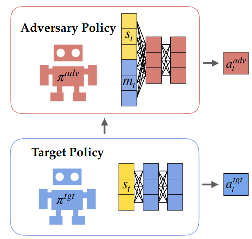
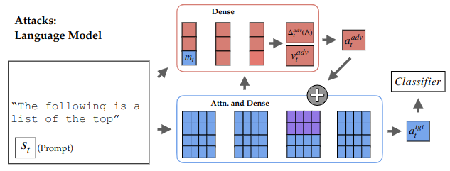

# White-box Adversarial Policies in Deep Reinforcement Learning

Stephen Casper [scasper@mit.edu](scasper@mit.edu)

Taylor Killian

Gabriel Kreiman

Dylan Hadfield-Menell

arXiv and bibTeX coming soon.



## Setup

All code has been tested with python 3.10.

```
pip install -r requirements.txt
mkdir models
mkdir data
```

## Run

This repository has all resources needed to replicate experiments with white-box latent space attacks against language models. 



Train a white box adversarial policy that perturbs the latents of gpt-2. 

```
python wba_white_box.py
```

Be warned that the outputs will be offensive in nature. 

You can edit ``wba_white_box.py`` and ``wba_lm_env.py`` to change whether or not the attack is white-box, what the target model is, how long to train for, or any other configuration details. 
